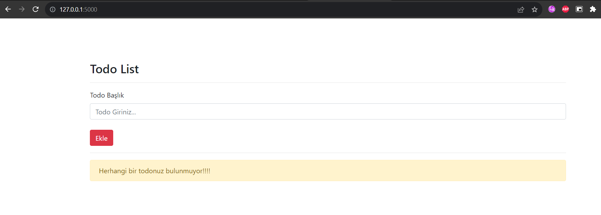

<!DOCTYPE html>
<html lang="en">

<head>
    <meta charset="UTF-8">
    <meta name="viewport" content="width=device-width, initial-scale=1.0">
    <title>Todo App</title>
</head>
<body>
    <h1>📝 Todo App</h1>
    
    <h2>Description / Açıklama</h2>
    
This is a simple Todo web application built with Flask and SQLAlchemy. It allows users to create, update, and delete tasks in a to-do list.

    
Bu basit bir Flask ve SQLAlchemy ile yapılmış bir Todo web uygulamasıdır. Kullanıcıların yapılacaklar listesi oluşturmasına, güncellemesine ve silmesine olanak tanır.

    <h2>Features / Özellikler</h2>
    <ul>
        <li>Add new tasks / Yeni görevler ekleme</li>
        <li>Mark tasks as completed / Görevleri tamamlandı olarak işaretleme</li>
        <li>Delete tasks / Görevleri silme</li>
    </ul>
    <h2>Installation / Kurulum</h2>
    <ol>
        <li>Clone the repository:</li>
        <pre><code>git clone https://github.com/username/todo-app.git</code></pre>
        <li>Install the dependencies:</li>
        <pre><code>pip install -r requirements.txt</code></pre>
        <li>Run the application:</li>
        <pre><code>python todo.py</code></pre>
    </ol>
    <ol>
        <li>Depoyu klonlayın:</li>
        <pre><code>git clone https://github.com/kullanici_adi/todo-app.git</code></pre>
        <li>Bağımlılıkları yükleyin:</li>
        <pre><code>pip install -r requirements.txt</code></pre>
        <li>Uygulamayı çalıştırın:</li>
        <pre><code>python todo.py</code></pre>
    </ol>
    <h2>Usage / Kullanım</h2>
    <ul>
        <li>Visit the website at <a href="http://localhost:5000">http://localhost:5000</a></li>
        <li>Add, complete, or delete tasks as needed.</li>
    </ul>
    
</body>
</html>
